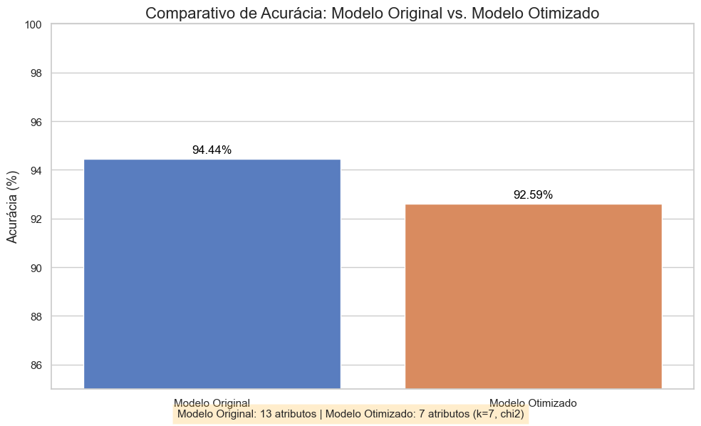

# Classificação de Vinhos: Otimização via Seleção de Atributos 🍷

Este projeto acadêmico foca na aplicação de técnicas de **Feature Selection** para otimizar um modelo de classificação de vinhos, buscando o melhor equilíbrio entre simplicidade (menor dimensionalidade) e performance (acurácia).

## 🎯 Objetivo
Comparar a performance de um modelo **Naive Bayes (GaussianNB)** utilizando o conjunto total de 13 atributos contra uma versão simplificada utilizando apenas os 7 atributos mais relevantes, selecionados via teste estatístico **Chi-Squared**.

## 🛠️ Tecnologias Utilizadas
* **Python 3.12**
* [cite_start]**Pandas**: Manipulação e análise exploratória[cite: 22].
* [cite_start]**Scikit-Learn**: Pré-processamento, modelagem e métricas[cite: 18, 51].
* **Matplotlib/Seaborn**: Visualização de dados.

## 📈 Resultados Obtidos

Utilizando o método `SelectKBest(chi2, k=7)`, foi possível reduzir a complexidade do modelo em aproximadamente **46%** mantendo uma performance de alto nível:

| Cenário | Atributos | Acurácia |
| :--- | :---: | :---: |
| **Modelo Original** | 13 | **94.44%** |
| **Modelo Otimizado** | 7 | **92.59%** |

### Visualização do Comparativo de Acurácia:

### 🧠 Conclusão
A redução de dimensionalidade provou ser extremamente eficaz. A perda de apenas ~1.8% na acurácia é amplamente compensada pela criação de um modelo mais leve, rápido e de menor custo computacional, características essenciais para deploy em ambientes de produção de larga escala.

## 📂 Como executar
1. Clone o repositório: `git clonehttps://github.com/lucasm-brandao/wine-classification-feature-selection`
2. Instale as dependências: `pip install -r requirements.txt`
3. Execute o notebook: `jupyter notebook projeto_vinhos.ipynb`

---
[cite_start]Desenvolvido por [Lucas de Moraes Brandão](https://www.linkedin.com/in/lucas-mbrandao/) - Estudante de Ciência da Computação @ **UFRJ**[cite: 1, 8].